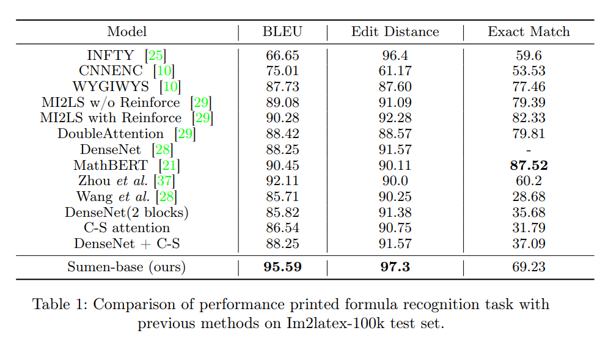
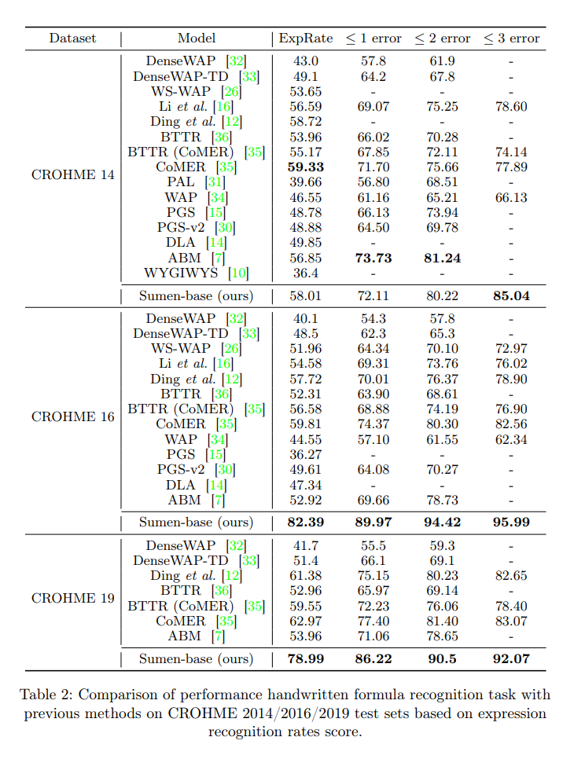

# <font color="turquoise"> <p style="text-align:center"> Translating Math Formula Images To LaTeX Sequences </p> </font>


Scaling Up Image-to-LaTeX Performance: Sumen An End-to-End Transformer Model With Large Dataset [Paper](docs/Paper-Scaling_Up_Image_to_LaTeX_Performance_Sumen_An_End_to_End_Transformer_Model_With_Large_Dataset.pdf).

## Performance





## Setup

- To run the model you need Python >= 3.8:
    ```bash
    conda create --name img2latex python=3.8 -y
    ```

- Install environment:
    ```bash
    pip install -r requirements.txt
    ```
    or
    ```bash
    conda env create -f environment.yml
    ```
    

## Uses


#### Available Model Checkpoint
We provide many Sumen model(base) - 349m params on Hugging Face, which can be downloaded at [hoang-quoc-trung/sumen-base](https://huggingface.co/hoang-quoc-trung/sumen-base).


#### Training
```bash
python train.py --config_path src/config/base_config.yaml --resume_from_checkpoint true

arguments:
    -h, --help                   Show this help message and exit
    --config_path                Path to configuration file
    --resume_from_checkpoint     Continue training from saved checkpoint (true/false)
```

#### Inference
```bash
python inference.py --input_image assets/example_1.png --ckpt src/checkpoints

arguments:
    -h, --help                   Show this help message and exit
    --input_image                Path to image file
    --ckpt                       Path to the checkpoint model
```

#### Test
```bash
python test.py --config_path src/config/base_config.yaml --ckpt src/checkpoints

arguments:
    -h, --help                   Show this help message and exit
    --config_path                Path to configuration file
    --ckpt                       Path to the checkpoint model
```

#### Web Demo
```bash
streamlit run streamlit_app.py --ckpt src/checkpoints

arguments:
    -h, --help                   Show this help message and exit
    --ckpt                       Path to the checkpoint model
```
or
```bash
python gradio_app.py --ckpt src/checkpoints

arguments:
    -h, --help                   Show this help message and exit
    --ckpt                       Path to the checkpoint model
```

## Dataset

Dataset is available here: [Fusion Image To Latex Dataset](https://www.kaggle.com/datasets/hongtrung/image-to-latex-dataset)

The directory data structure can look as follows:
* Save all images in a folder, replace the path as `root` in config file.
* Prepare a CSV file with 2 columns:
    * `image_filename`: The name of image file.
    * `latex`: Latex code.

Samples:
|image_filename|latex|
|:--:|:--:|
|200922-1017-140.bmp|\sqrt { \frac { c } { N } }
78cd39ce-71fc-4c86-838a-defa185e0020.jpg|\lim_{w\to1}\cos{w}
KME2G3_19_sub_30.bmp|\sum _ { i = 2 n + 3 m } ^ { 1 0 } i x
1d801f89870fb81_basic.png|\sqrt { \varepsilon _ { \mathrm { L J } } / m \sigma ^ { 2 } }