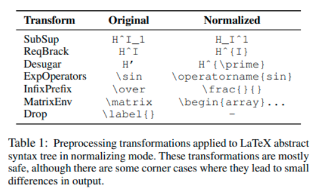

#  
 Normalize Raw LaTeX Code 
 

Directly taken from https://github.com/lukas-blecher/LaTeX-OCR

 
[What You Get Is What You See: A Visual Markup Decompiler](https://arxiv.org/pdf/1609.04938v1.pdf)

 
 
 

Process raw latex with [KaTeX parser](https://github.com/KaTeX/KaTeX) for data with CSV format:

|image_filename|latex| 
|:--:|:--:|
|200922-1017-140.bmp|\sqrt { \frac { c } { N } }
78cd39ce-71fc-4c86-838a-defa185e0020.jpg|\lim_{w\to1}\cos{w}
KME2G3_19_sub_30.bmp|\sum _ { i = 2 n + 3 m } ^ { 1 0 } i x
1d801f89870fb81_basic.png|\sqrt { \varepsilon _ { \mathrm { L J } } / m \sigma ^ { 2 } }

 
 

TO USE -> [notebook](./using_normalize.ipynb)

